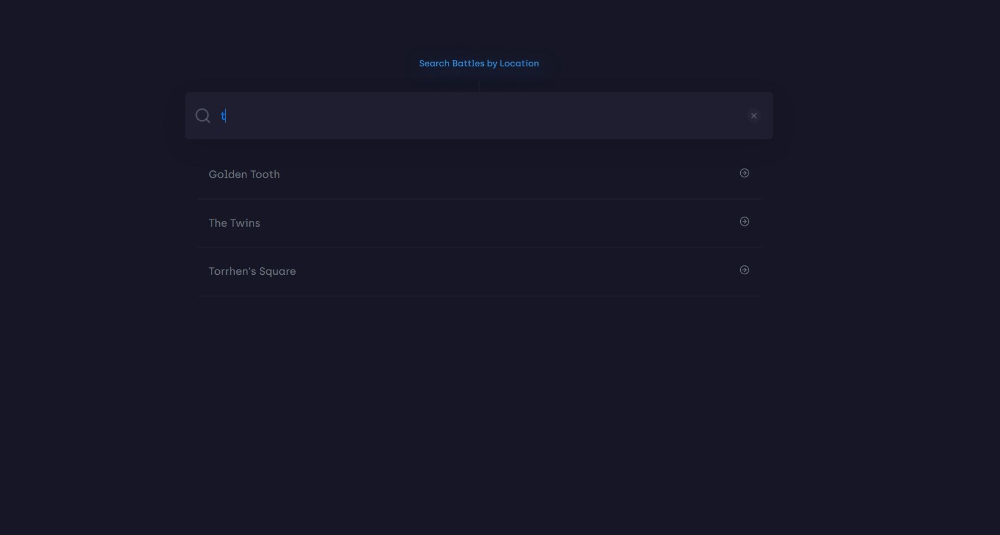
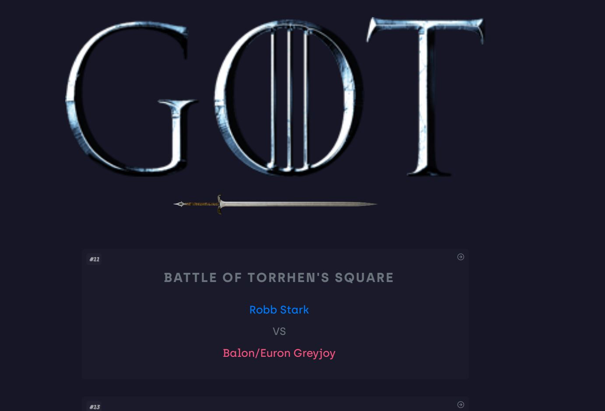
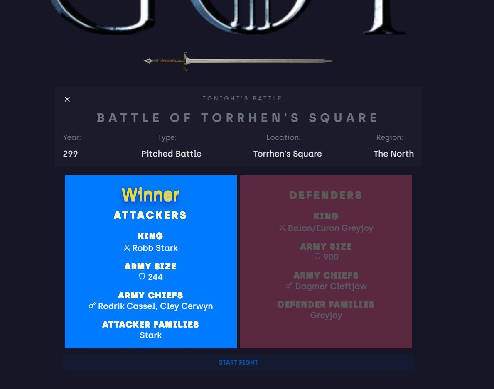

# Game-of-Thrones-Battles
MERN Stack App for G.O.T Battle Data

### Installing steps to Run the App Locally:
****

1. Clone the app
2. Open Terminal 1 - Run *npm install*
3. do *cd Client*
4. Run *npm install*
5. Run do *cd ..*
6. *npm start*
7. Open Terminal 2 - *cd Client*
8. Run *npm start* - will ask for different port option. Enter Y

**Live App** : https://gameofthronesbattles.herokuapp.com/

App Snapshots:

